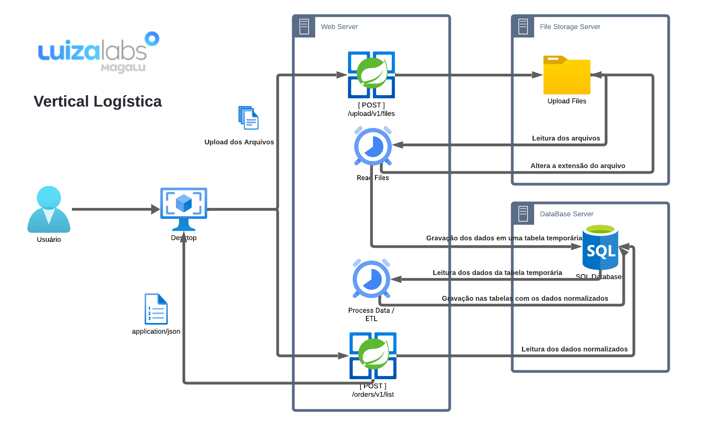

# Desafio LuizaLabs Vertial Logística

## Desafio 
Fazer um sistema que receba um arquivo via **API REST** e processe-o para ser retornado via API
REST.

### Ferramentas Utilizadas para Desenvolvimento

```
IntelliJ IDEA
DBeaver
Postman
Spring Boot     
PostgresSQL
```

## Dependências

O desenvolvimento de código em Java, em geral, usufrui de um significativo conjunto de bibliotecas e _frameworks_. Esta
reutilização é incorporada em um projeto por meio de dependências. Para gerenciar foi utiliado o _Maven_.

```
Spring Web MVC
Spring JPA
Postgres JDBC
Lombok
Flyway
MapStruct
DevTools
Validation
```
## Dependências

## Métodos

Requisições para a API devem seguir os padrões:

| Método | Descrição |
|---|---|
| `GET` | Retorna informações de um ou mais registros. |
| `POST` | Utilizado para criar um novo registro. |
| `PUT` | Atualiza dados de um registro ou altera sua situação. |
| `DELETE` | Remove um registro do sistema. |

## Respostas

| Status | Descrição                                                          |
|--------|--------------------------------------------------------------------|
| `200`  | Requisição executada com sucesso (success).                        |
| `201`  | Requisição executada com sucesso (success).                        |
| `400`  | Erros de validação ou os campos informados não existem no sistema. |
| `409`  | Conflito.                                                          |
| `405`  | Método não implementado.                                           |

# **Recursos da API**

| Método | Endpoint         |
|--------|------------------|
| `POST` | /upload/v1/files |
| `POST` | /orders/v1/list  |


## Upload de Arquivos.

### Listar [ **POST** _/upload/v1/files_ ]


Request (form-data)

Response 200 (html/text)

## Buscar Pedidos.

### Listar [ **POST** _/orders/v1/list_ ]


Request (application/json)

        {
            "idOrder" : 539,
            "dataStart": "2021-09-03",
            "dataEnd": "2021-09-05"
        }

Response 200 (application/json)

        [
            {
                "user_id": 49,
                "name": "Ken Wintheiser",
                "orders": [
                    {
                        "order_id": 523,
                        "total": "586.74",
                        "date": "2021-09-03",
                        "products": [
                            {
                            "product_id": 3,
                            "value": "586.74"
                            }
                        ]
                    }
                ]
            }
        ]